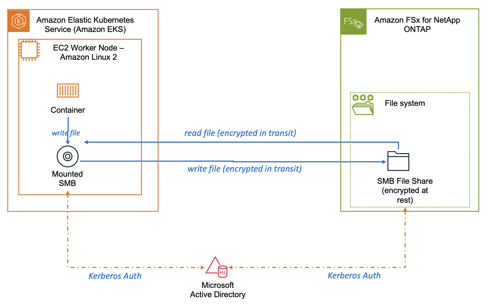
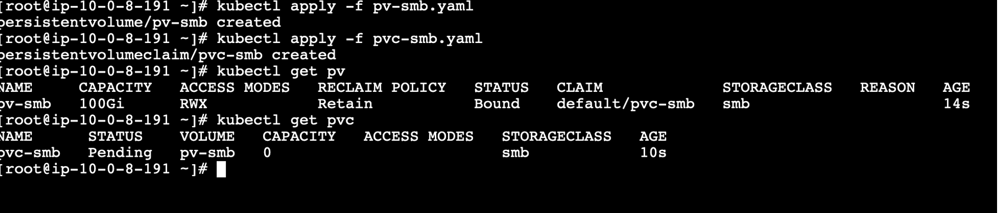
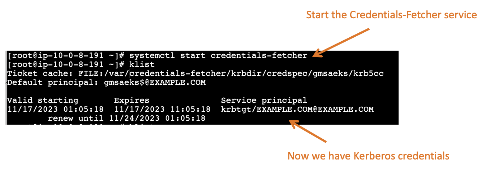

# Using Credentials-Fetcher with EKS/SMB


### Example use case

You run EKS pods on EC2 using Amazon Linux 2 and require access to SMB file shares using Kerberos authentication, even when the EKS worker nodes are not part of the Windows Active Directory domain. The use of Kerberos authentication is crucial to guarantee SMB encryption-in-transit for compliance purposes.

### Solution

Implement the SMB CSI Driver with Kerberos authentication settings to enable the mounting of SMB shares onto the pods. Employ the Credentials-Fetcher to generate and update Kerberos tickets as needed.



### References

* https://github.com/kubernetes-csi/csi-driver-smb
* https://aws.amazon.com/blogs/containers/using-amazon-fsx-for-windows-file-server-as-persistent-storage-on-amazon-eks/
* https://aws.amazon.com/blogs/opensource/aws-now-supports-credentials-fetcher-for-gmsa-on-amazon-linux-2023/
* 

### Prerequisites:

* Microsoft Active Directory
* gMSA Account in Active Directory
* credspec.json generated from the gMSA Account
* User account with permissions to query gMSA account
* AWS Secrets Manager secret with username/password/domainName to the User Account
* FSx NetApp with an SMB File share on a Volume configured with NTFS permissions style
* FSx Netapp joined to Active Directory
* SMB File share permissions assigned to the gMSA account granting read/write
* Amazon EKS Cluster
* Amazon EKS Worker Node operating on Amazon Linux 2
* EKS Worknode EC2 Instance Role configured with policy to read Secrets Manager secret
* kubectl installed and configured for EKS Cluster


### Install SMB CSI Driver

```
curl -skSL https://raw.githubusercontent.com/kubernetes-csi/csi-driver-smb/v1.13.0/deploy/install-driver.sh | bash -s v1.13.0 --

#smb cis driver will write empty kerberos ticket (stored as base64 encoded string) here. This ticket will not actually be used 
mkdir -p /var/lib/kubelet/kerberos/

#needed to mount cifs(smb)
yum install -y cifs-utils -y
```

```

mkdir -p /etc/krb5.conf.d/
echo "[libdefaults]
#SMB CSI Driver should look for krbcc files output by Credentials-Fetcher, 
#not the placeholder ticket stored in Kubernetes secret 
default_ccache_name = FILE:/var/credentials-fetcher/krbdir/credspec/gmsaeks/krb5cc" > /etc/krb5.conf.d/ccache.conf

```


### Create SMBCreds Secret

```
#This kerberos ticket cache won't actually be used
#just use an "empty" file
#cifs/smb mount will actually find anduse gMSA ticket in
#/var/credentials-fetcher/krbdir/credspec/gmsaeks/krb5cc
#created by credentials-fetcher service

echo "empty" > /tmp/emptycache
export EMPTYCACHEFILE=/tmp/emptycache
export CF_CRED_SPEC_FILE=/home/ec2-user/credentials-fetcher/sample_credspec/sample_credspec.json
EMPTYCACHE=$(base64 -w 0 $EMPTYCACHEFILE)

kubectl create secret generic smbcreds --from-literal krb5cc_0=$EMPTYCACHE


```

### Apply Persistent Volume (PV)

create pv-smb.yaml with below contents:
```
---
apiVersion: v1
kind: PersistentVolume
metadata:
  annotations:
    pv.kubernetes.io/provisioned-by: smb.csi.k8s.io
  name: pv-smb
spec:
  capacity:
    storage: 100Gi
  accessModes:
    - ReadWriteMany
  persistentVolumeReclaimPolicy: Retain
  storageClassName: smb
  mountOptions:
    - sec=krb5
    - cruid=0
    - dir_mode=0777
    - file_mode=0777
    - uid=1000   
    - gid=1000
    - noperm
    - mfsymlinks
    - cache=strict
    - noserverino  # required to prevent data corruption
  csi:
    driver: smb.csi.k8s.io
    readOnly: false
    # volumeHandle format: {smb-server-address}#{sub-dir-name}#{share-name}
    # make sure this value is unique for every share in the cluster
    volumeHandle: smb-server.default.svc.cluster.local/share##
    volumeAttributes:
      source: "//svm1.example.com/smb1"
    nodeStageSecretRef:
      name: smbcreds
      namespace: default
```

```
kubectl apply -f pv-smb.yaml
```


### Apply Persistent Volume Claim (PVC)

Create pvc-smb.yaml with contents below:
```
---
kind: PersistentVolumeClaim
apiVersion: v1
metadata:
  name: pvc-smb
spec:
  accessModes:
    - ReadWriteMany
  resources:
    requests:
      storage: 10Gi
  volumeName: pv-smb
  storageClassName: smb
```

```
kubectl apply -f pvc-smb.yaml
```




### Install Credentials-Fetcher Amazon Linux 2 RPM

```
#add Microsoft repo so .Net 6 dependency can be installed
sudo rpm -Uvh https://packages.microsoft.com/config/centos/7/packages-microsoft-prod.rpm  

yum install credentials-fetcher-1.2.0-3.amzn2.x86_64.rpm -y

```
### store credspec.json in /var/credentials-fetcher/credspec.json

### configure AWS region to your region
```
aws configure set default.region us-east-1
```
### Set environment variables and command line params for  [credentials-fetcher.service](https://github.com/awsjohns/credentials-fetcher/blob/34777570e5c49d93258038d6d4c6d8bef33d306b/scripts/systemd/credentials-fetcher.service)

* Edit /usr/lib/systemd/system/credentials-fetcher.service

```
#we need to set so credentials-fetcher doesn't use whats in /etc/krb5.conf.d for the user ticket.
#/var/credentials-fetcher/krbdir/credspec/gmsaeks/krb5cc is for the gMSA ticket 
Environment="KRB5CCNAME=/var/credentials-fetcher/krbdir/krb5cc"
#add secret parameter
ExecStart=/usr/sbin/credentials-fetcherd --aws_sm_secret_name gmsa-plugin-input
```

### Start daemon service

```
#start the service
sudo systemctl start credentials-fetcher.service

#view the logs
sudo journalctl -u credentials-fetcher
```




### Test with EKS Pod that reads/writes to SMB file share


create pv-smb-pod.yaml with below YAML:

```
apiVersion: v1
kind: Pod
metadata:
  name: pod-smb-reader-writer
spec:
  volumes:
  - name: smb-pv-storage
    persistentVolumeClaim:
      claimName: pvc-smb
  containers:
  - image: busybox
    name: smb-writer
    command: ["/bin/sh","-c","while true; do echo $(date) Logging data >> /output/output.log; echo wrote; sleep 5; done"]
    volumeMounts:
    - name: smb-pv-storage
      mountPath: /output
  - image: busybox
    name: smb-reader
    command: ['/bin/sh', '-c', 'tail -f /input/output.log']
    volumeMounts:
    - name: smb-pv-storage
      mountPath: /input
```

### Deploy the EKS pod


```
kubectl apply -f pv-smb-pod.yaml
```

### Confirm the pod has a Running status
```

# kubectl get pods
NAME                    READY   STATUS    RESTARTS   AGE
pod-smb-reader-writer   2/2     Running   0          22s
```


### Open the file on file share to confirm

