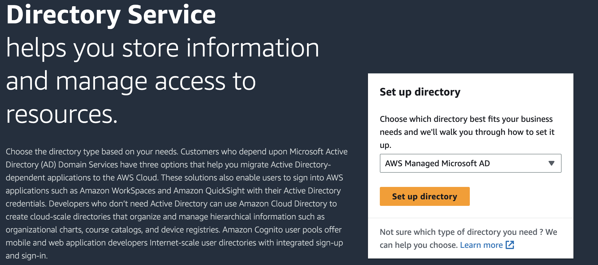
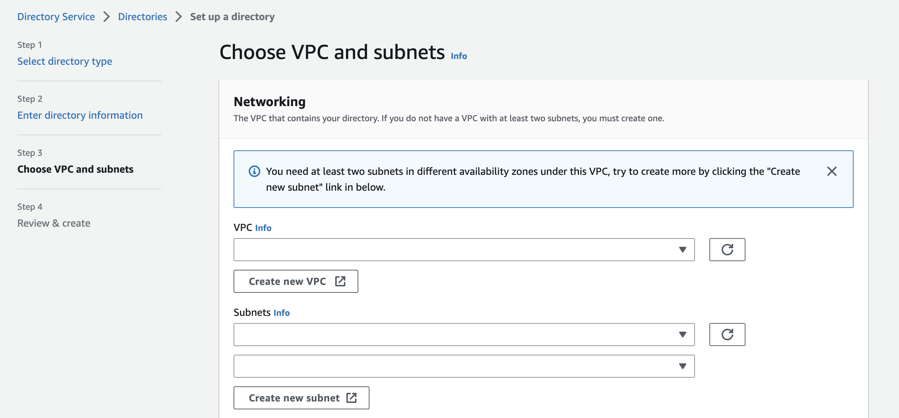

# Using Credentials-fetcher with Kubernetes (EKS)

Note: The Credentials-fetcher daemon does not communicate with the AWS EKS control-plane, modifications to /etc/credentials-fetcher.conf and /etc/credentials_fetcher_kubeconfig.json are sufficient.

## Steps in brief
If you are already familiar with EKS, AD and credentials-fetcher, these are steps you can use for EKS:
* After extracting RPM, uncomment mode in /etc/credentials_fetcher.conf to use EKS
* Uncomment and modify path to the credentials-fetcher kube config json
* Modify /etc/credentials_fetcher_kubeconfig.json
* Start daemon


## Notes

* The Credentials-fetcher daemon does not create or modify any VPC, subnet settings.
* The configuration below is not a production configuration, customers need to make appropriate changes for production deployment.

This is a simplified description of how to integrate Active Directory with EKS using the credentials-fetcher daemon. 

Using this feature, applications running in EKS pods can use Windows Authentication to access SQL server or other services using Windows Authentication.
Applications running in EKS use AD credentials shared by the credentials-fetcher daemon running in a domain-joined instance, sharing of AD credentials is done using kubernetes.

For simplicity, the EKS cluster is created first and then Active Directory instance/server is added to one of the EKS subnets.

## Step 1. Install eksctl

`eksctl` is a command line tool for creating and managing Kubernetes clusters on Amazon EKS. For the official documentation, see https://eksctl.io/

Installation instructions to install eksctl are available [here](https://github.com/eksctl-io/eksctl/blob/main/README.md#installation)

Check eksctl version if it is installed correctly.
```bash
eksctl version
```

## Step 2. Create EKS cluster

Create a custom yaml file such as the following

````bash
apiVersion: eksctl.io/v1alpha5
kind: ClusterConfig

metadata:
  name: basic-cluster
  region: us-west-1

nodeGroups:
  - name: ng-1
    instanceType: m5.large
    desiredCapacity: 2
````

Create EKS cluster using above custom yaml file.

```bash
eksctl create cluster -f cluster.yaml
```
eksctl creates a new VPC, subnets and IAM roles as well as 2 instances as mentioned in the yaml file above.

## Step 3. Setup Managed Active Directory domain using AWS console.

**NOTE:**
Please make sure Active Directory and EKS use the same VPC and subnets or setup VPC peering and routes for connectivity between Active Directory and EKS.

Click on 'Setup directory'



Select VPC and subnets created by eksctl



## Step 4. Launch an instance and domain-join to the AD domain created above.
Domain-join can be done during instance launch as per [here](https://docs.aws.amazon.com/directoryservice/latest/admin-guide/seamlessly_join_linux_instance.html).
Install the credentials-fetcher daemon on the domain-joined instance.


## Step 5. Modify EKS and AD security groups
Security groups for EKS and AD need to be modified so that the new domain-joined instance can access the EKS cluster and is also able to access the AD domain as before.
Make sure the EKS nodes have network connectivity to the domain, by using the nslookup command or ping.

## Step 6. Create and associate a Kubernetes secret and add a Kerberos ticket in it
### Yaml file for the secret is as follows


```yaml
%cat secret1.yaml
apiVersion: v1
data:
  password: YWJjCg==
kind: Secret
metadata:
  name: krb-ticket1
  ```

### Yaml file for the pod is as follows

If you have a [custom DHCP option set that sets the DNS](https://docs.aws.amazon.com/vpc/latest/userguide/DHCPOptionSetConcepts.html#CustomDHCPOptionSet) in your VPC, you can skip the `dnsConfig` step in the yaml file below.

Create a pod with DNS pointing to the AD domain above.
For example, `192.168.102.60` is the IP address of the AD domain `customertest.local` in the pod.yaml below.

```yaml
apiVersion: v1
kind: Pod
metadata:
  name: secret-test-pod
spec:
  nodeSelector:
     kubernetes.io/os: Linux
  containers:
    - name: test-container1
      image:  ubuntu
      command:
        # Add your app here instead of sleep and the large number parameter
        - "sleep"
        - "4453645654757"
      volumeMounts:
        # name must match the volume name below
        - name: secret-volume
          mountPath: /etc/secret-volume
          readOnly: true
  dnsPolicy: "ClusterFirstWithHostNet"
  hostNetwork: true
  dnsConfig:
    nameservers:
      - 192.168.102.60 # this is an example
    searches:
      - customertest.local
  # The secret data is exposed to Containers in the Pod through a Volume.
  volumes:
    - name: secret-volume
      secret:
        secretName: krb-ticket1
```

## Step 7. Start Credentials-fetcher with kube config json file as below
kube_context below refers to the kubectl context, this allows a gMSA account to be used in multiple node-groups.

```bash
% credentials_fetcher --kube-config kube_config.json

% cat kubeconfig.json
{
  "ServiceAccountMappings": [
    {
      "ServiceAccountName": "webapp01",
      "path_to_cred_spec_json": "customertest_webapp01.json",
      "domainless_user": "",
      "kube_context": [
        {
          "kube_context_name": "name",
          "path_to_kube_folder": "/home/ec2-user/credentials-fetcher/build",
          "path_to_kube_secret_yaml_file": "/home/ec2-user/credentials-fetcher/build/secret1.yaml"
        }
      ]
    },
    {
      "ServiceAccountName": "webapp01",
      "path_to_cred_spec_json": "customertest_webapp01.json",
      "domainless_user": "",
      "kube_context": [
        {
          "kube_context_name": "name",
          "path_to_kube_folder": "/home/ec2-user/credentials-fetcher/build",
          "path_to_kube_secret_yaml_file": "/home/ec2-user/credentials-fetcher/build/secret1.yaml"
        }
      ]
    }
   ]
}

```


## Step 8. Secrets in the pod
Secrets are available in the `mountPath` specified in the container yaml, please name the `mountPath` as needed.

      volumeMounts:
        - name: secret-volume
          mountPath: /etc/secret-volume
          readOnly: true

The secret can be seen under `mountPath` as below.

```bash
[ec2-user@EC2AMAZ-3UYjZe ~]$ kubectl get pods
NAME              READY   STATUS    RESTARTS      AGE
secret-test-pod   1/1     Running   1 (14h ago)   14d
[ec2-user@EC2AMAZ-3UYjZe ~]$ kubectl exec -it secret-test-pod -- /bin/bash
root@ip-192-168-5-114:/# ls /etc/secret-volume/
password
root@ip-192-168-5-114:/#
```

The kerberos ticket can be seen as below.
```
root@ip-192-168-5-114:/# export KRB5CCNAME=/etc/secret-volume/password
root@ip-192-168-5-114:/# klist
Ticket cache: FILE:/etc/secret-volume/password
Default principal: webapp01$@CUSTOMERTEST.LOCAL

Valid starting     Expires            Service principal
07/26/23 18:56:51  07/27/23 04:56:51  krbtgt/CUSTOMERTEST.LOCAL@CUSTOMERTEST.LOCAL
        renew until 08/02/23 18:56:50
```
##


